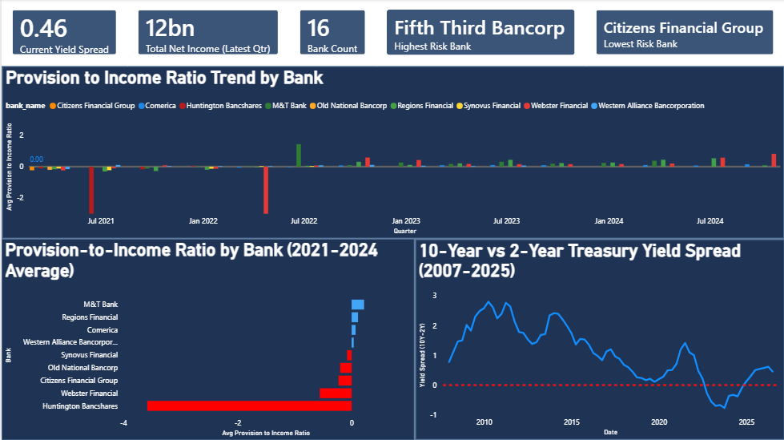
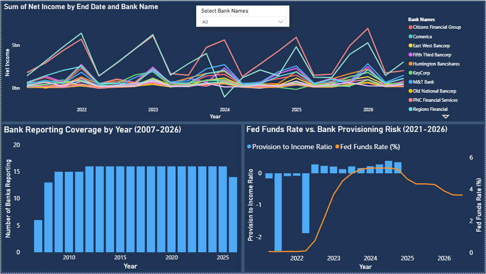
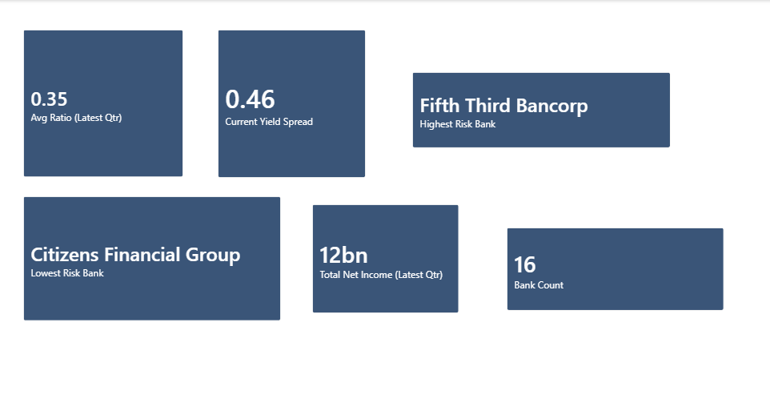
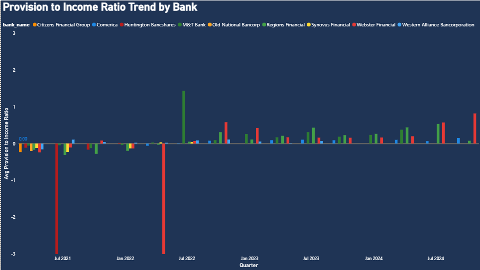
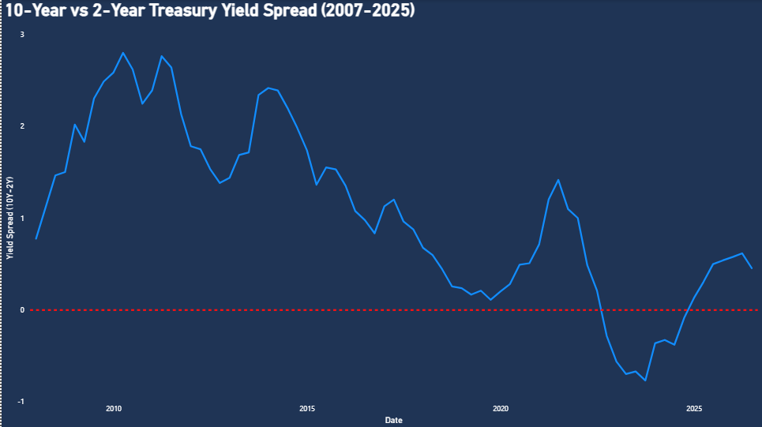
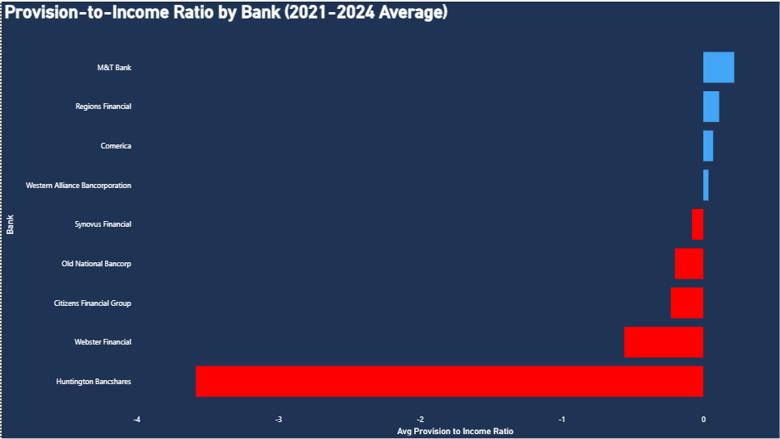
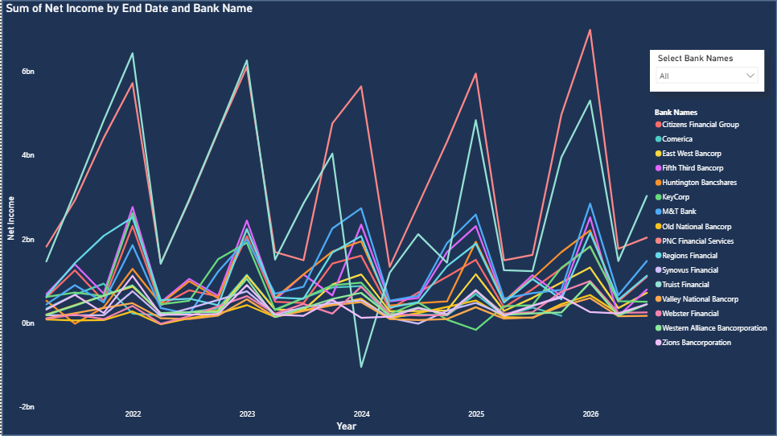
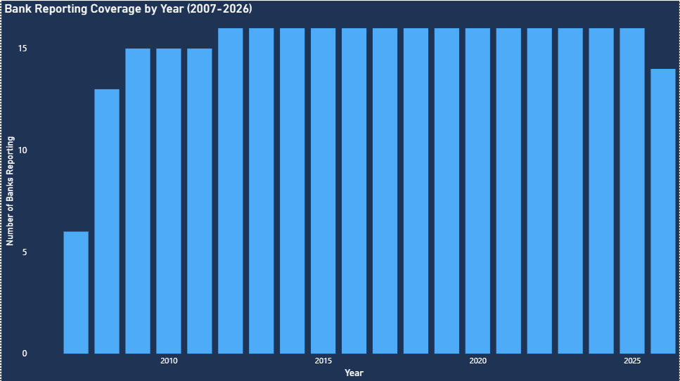
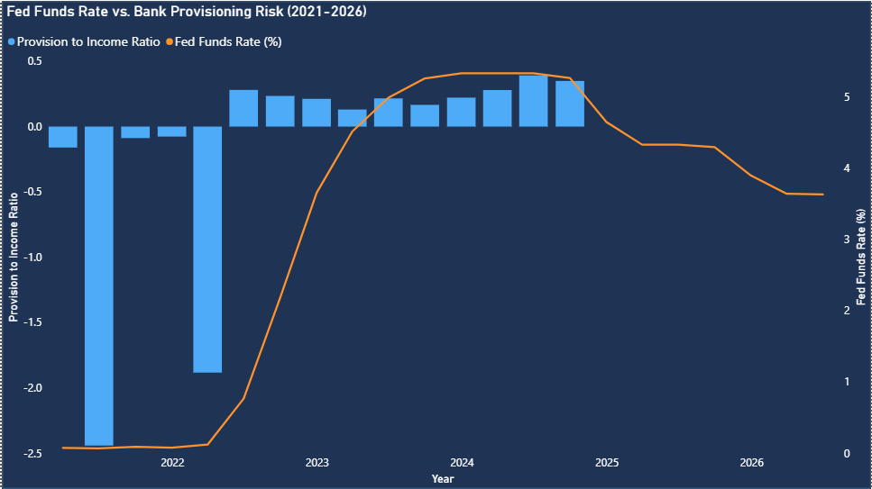

# Bank Risk BI Project

An end-to-end Business Intelligence and data engineering project analyzing **regional bank financial risk indicators** against **Federal Reserve interest rate data**. Built to demonstrate a full pipeline: raw data ingestion, cloud data warehousing, SQL transformation, and interactive dashboarding.

## Why I Built This

After graduating, I've been working as an IT Support Associate at the Siebel School of Computer and Data Science — a role that keeps me close to technical systems, but not to the kind of hands-on data analysis and modeling I wanted to build a career around. This project was my way of proving that side of myself: a self-directed portfolio piece to demonstrate real data analytics and data science skills, not just tell people I have them.

I'd previously built a **Credit Score Classification** project, which gave me a first taste of working with financial data — but it stayed at the individual-record, machine-learning level. I wanted to go deeper into the transactional and banking side specifically, working with real-world, messier data at an institutional scale rather than a clean, pre-labeled dataset. That pushed me toward pulling actual SEC EDGAR filings and FRED interest rate data, building the full pipeline myself through BigQuery and SQL, and turning it into a Power BI dashboard that tells a real story about how monetary policy flows through to bank-level credit risk.

## Overview

This project investigates how rising/falling interest rates correlate with financial stress signals (provisioning behavior, net income volatility, yield curve dynamics) across 16 regional banks, using public regulatory and macroeconomic data spanning 2007-2026.

## Tech Stack

- **Data Sources:** SEC EDGAR (bank filings), FRED (Federal Reserve Economic Data)
- **Data Warehouse:** Google BigQuery
- **Transformation:** SQL
- **Visualization:** Power BI
- **Pipeline Scripts:** Python (`scripts/fetch_data.py`, `scripts/download_data.py`)

## Architecture

1. **Ingestion** — Python scripts pull filings data from SEC EDGAR and interest rate series from FRED via their public APIs.
2. **Storage** — Raw and cleaned data is loaded into BigQuery tables.
3. **Transformation** — SQL views model risk indicators by bank and by reporting period, joined against Fed rate movements.
4. **Visualization** — Power BI connects to the modeled data to produce an interactive dashboard tracking risk indicators by bank and end date.

## SQL Data Pipeline

All transformation logic lives in BigQuery as chained SQL views (see [`sql/`](./sql)), applied in this order:

1. **[`fred_rates_clean`](sql/01_create_fred_rates_clean_view.sql)** — casts raw FRED values to `FLOAT64`, safely handling FRED's `.` placeholder for missing observations.
2. **[`fred_rates_pivoted`](sql/02_create_fred_rates_pivoted_view.sql)** — pivots long-format FRED series (Fed Funds daily/monthly, 30-year mortgage rate, 10Y-2Y yield spread) into one row per date.
3. **[`bank_financials_pivoted`](sql/03_create_bank_financials_pivoted_view.sql)** — deduplicates overlapping 10-Q/10-K filings per bank and period (preferring 10-Q), then pivots key XBRL fields (provisions, allowances, net income) into one row per bank per `end_date`.
4. **[`bank_risk_master`](sql/04_create_bank_risk_master_view.sql)** — joins pivoted bank financials to quarterly-aggregated FRED rates on fiscal quarter end date.
5. **[`bank_risk_ratios`](sql/05_create_bank_risk_ratios_view.sql)** — computes the core risk metrics used throughout the dashboard: `provision_to_income_ratio` and `allowance_to_provision_ratio`, using `SAFE_DIVIDE` to avoid divide-by-zero errors.

This final `bank_risk_ratios` view is the direct data source for the Power BI report.

## Dashboard Preview

### Bank Risk Overview
The main risk-monitoring page, combining four panels at a glance: portfolio-wide KPIs, per-bank provisioning trend, per-bank risk ranking, and macro yield spread context.



### Macro & Coverage Trends
Pairs bank-level financial performance with macro rate context and historical data coverage: net income trends by bank, historical bank reporting coverage (2007-2026), and Fed Funds Rate plotted against aggregate provisioning risk.



<details>
<summary>Individual chart views (with explanations)</summary>

**KPI Summary Cards** — six headline metrics: average provision-to-income ratio in the latest quarter (0.35), the current 10Y-2Y yield spread (0.46), the highest-risk bank by that ratio (Fifth Third Bancorp), the lowest-risk bank (Citizens Financial Group), aggregate net income across the panel in the latest quarter ($12B), and the total number of banks tracked (16).


**Provision-to-Income Ratio Trend by Bank** — quarterly bars per bank from mid-2021 onward. Large negative bars in 2021 and early 2022 reflect banks releasing pandemic-era loan-loss reserves; the shift to consistently positive bars from mid-2022 onward reflects rebuilding reserves as the Fed began raising rates.


**10-Year vs 2-Year Treasury Yield Spread (2007-2025)** — the classic recession-warning indicator. The spread compresses toward zero ahead of the 2008 crisis and again in 2019, then inverts for a sustained period in 2022-2024 before recovering to positive territory.


**Provision-to-Income Ratio by Bank (2021-2024 Average)** — ranks 9 banks by average risk over the period. Huntington Bancshares stands out as a clear high-risk outlier, while M&T Bank, Regions Financial, Comerica, and Western Alliance sit on the low-risk (blue) side.


**Sum of Net Income by End Date and Bank Name** — per-bank quarterly net income 2022-2026 with a bank-name filter. Shows meaningful volatility bank-to-bank, including at least one quarter with a net loss.


**Bank Reporting Coverage by Year (2007-2026)** — tracks how many of the 16 banks have reported in each year, rising from 6 in 2007 to a stable 16 from 2012 onward (2026 shows fewer since the year isn't complete).


**Fed Funds Rate vs. Bank Provisioning Risk (2021-2026)** — overlays the Fed Funds Rate line on provisioning bars, visually confirming that portfolio-wide provisioning tracked the Fed's hiking cycle almost lockstep, then eased slightly as rates began declining.


</details>

The full interactive report is available as a downloadable Power BI file: [`bank_risk_dashboard.pbix`](./bank_risk_dashboard.pbix). Open it in [Power BI Desktop](https://powerbi.microsoft.com/desktop/) (free) to explore all pages, filters, and tooltips.

## Key Findings

- **Provisioning flipped from a tailwind to a headwind as rates rose.** From 2021 into early 2022, banks were net *releasing* loan-loss reserves built up during the pandemic, pushing the aggregate provision-to-income ratio deeply negative (as low as roughly -2.5). Once the Fed began its 2022 hiking cycle, provisioning reversed hard and turned consistently positive through 2023-2024, tracking the Fed Funds Rate's climb from near 0% to roughly 5.3% almost lockstep — a clear signal that rate-driven credit stress replaced pandemic-era reserve releases as the dominant risk driver.
- **Risk is highly concentrated, not evenly spread.** Ranking all 16 banks by average provision-to-income ratio (2021-2024) shows **Huntington Bancshares** as a clear outlier on the high-risk side (average ratio near -4, driven by a few very large provisioning quarters), while **Fifth Third Bancorp** shows the highest risk in the latest quarter specifically and **Citizens Financial Group** the lowest — underscoring that portfolio-wide averages can mask which individual institutions are actually driving sector risk.
- **The yield curve inversion (2022-2024) lines up with the provisioning spike.** The 10-Year vs 2-Year Treasury spread went negative in mid-2022 for the first sustained period since 2007 and stayed inverted into 2024, directly overlapping the window of rising bank provisioning — consistent with the historical pattern of yield curve inversions preceding credit-cycle stress.
- **Coverage and scale are stable, but net income is volatile.** The panel has held steady at 16 reporting banks since 2012, with aggregate quarterly net income holding around $12B in the latest quarter. However, individual banks (e.g., Comerica, PNC Financial Services) show sharp quarter-to-quarter net income swings, including at least one quarter with a temporary net loss — highlighting that stability at the aggregate level can still hide meaningful single-bank volatility.
- **The current yield spread (0.46) suggests the curve has re-normalized.** After the 2022-2024 inversion, the spread has moved back into positive territory, which historically has coincided with easing credit stress — worth monitoring against whether bank provisioning follows the same normalization pattern in coming quarters.

## Repository Structure

```
.
├── README.md
├── bank_risk_dashboard.pbix   # Full interactive Power BI report
├── screenshots/               # Dashboard preview images
├── sql/                       # BigQuery view definitions (transformation pipeline)
│   ├── 01_create_fred_rates_clean_view.sql
│   ├── 02_create_fred_rates_pivoted_view.sql
│   ├── 03_create_bank_financials_pivoted_view.sql
│   ├── 04_create_bank_risk_master_view.sql
│   └── 05_create_bank_risk_ratios_view.sql
└── scripts/
    ├── fetch_data.py          # Pulls data from SEC EDGAR + FRED APIs
    └── download_data.py       # Handles local data download/staging
```

## Getting Started

1. Clone this repository.
2. Review `scripts/fetch_data.py` to see how source data is pulled from SEC EDGAR and FRED.
3. Review the `sql/` folder to see how raw data is transformed into risk metrics in BigQuery.
4. Open `bank_risk_dashboard.pbix` in Power BI Desktop to explore the finished dashboard.

## Key Skills Demonstrated

- API-based data ingestion (SEC EDGAR, FRED)
- Cloud data warehousing with BigQuery
- SQL-based data modeling and transformation (window functions, pivoting, safe joins/division)
- Interactive BI dashboard design in Power BI
- Translating raw financial data into actionable risk insights
- End-to-end project structuring for reproducibility

## Author

Built by [daworld10](https://github.com/daworld10) as a portfolio project demonstrating BI engineering skills across the full data pipeline, from raw ingestion to business-facing visualization.
